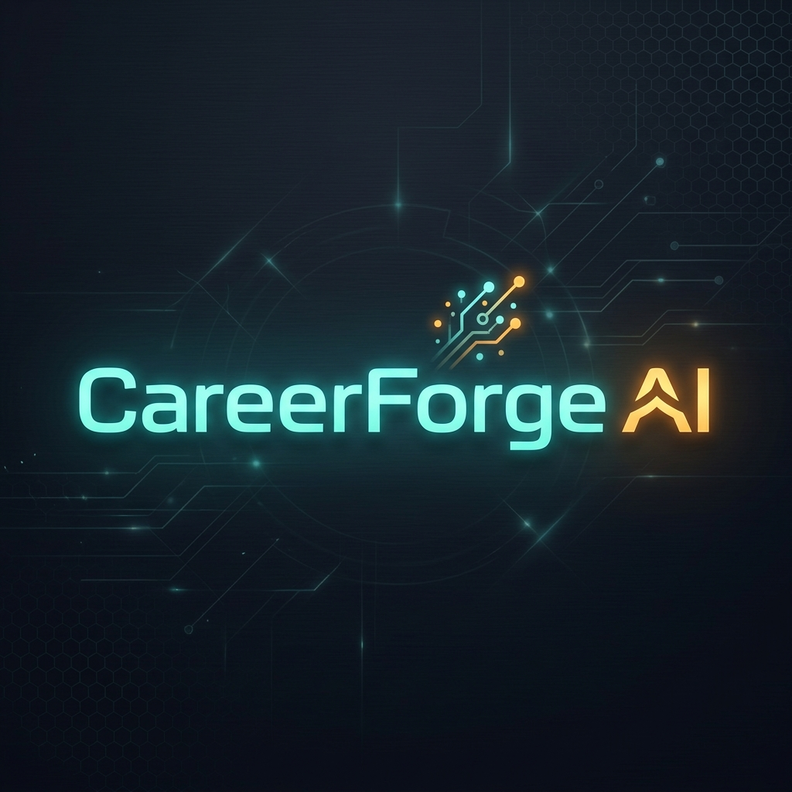

---
A modular, intelligent resume engineering, career intelligence, and interview simulation suite.
---

## Overview  
CareerForge AI is a Streamlit and FastAPI-powered suite designed for modern job seekers. It helps users analyze resumes for ATS optimization, compare profile skills to target job descriptions, draft tailored cover letters, and practice situational mock interviews. Powered by spaCy NLP and Google Gemini AI, it delivers actionable insights to optimize career placement.

---

## Modules and Functionality  

### 1. JobRadar
**Purpose**: Aggregates and matches job listings from various job listing platforms.

**Features**:
- Input preferred roles, companies, and locations  
- Fetch live listings from multiple platforms  
- Keyword-based filtering and deduplication  
- Display job cards with

### 2. JobMatcher
**Purpose**: Analyze how well a resume fits a specific job description (JD).

**Pipeline**:
- Upload or paste a JD
- Heuristically segment sections (title, requirements, etc.)
- Weight each section's importance
- Match hard/soft skills against JD
- Provide compatibility score, missing skills, learning resources

### 3. CareerMatch  
**Purpose**: Recommend ideal job roles based on resume skill analysis.

**Pipeline**:
- Parse resume (PDF/DOCX)
- Extract skills via NLP and fuzzy matching
- Canonicalize via `skills.json`
- Map to roles using `skill_to_job.json`
- Show matching job roles and role descriptions

### 4. SkillBridge  
**Purpose**: Compare resume skills with those needed for a selected job role.

**Pipeline**:
- Upload resume
- Select a role from `job_to_skills.json`
- Identify skill gaps
- Suggest resources for upskilling

### 5. ResumeBuilder  
**Purpose**: Form-based resume builder with AI-powered content enhancement.

**Features**:
- Ask number of entries per section
- Dynamically generate form inputs
- Render resume via Jinja2 or DOCX
- Optional Gemini API-based section rewording
- Export to HTML or DOCX
- Themes: Modern, Minimal, Harvard, Standard

### 6. ATS Tune-Up  
**Purpose**: Optimize resumes for ATS compatibility using rule-based and AI-powered evaluation.

**Features**:
- Upload resume
- Run local analysis across 13 key ATS checks
- AI-based Gemini resume analysis with structured, section-wise feedback
- Visual breakdown of issues and highlights (warnings and successes)
- Gemini API integration with key input and fallback handling
- Side-by-side Local vs AI analysis options

---

## Architecture

```
├── analyzer/                   # ATS TuneUp
├── builder/                    # ResumeBuilder 
├── data/                       # Skill and job datasets
├── preprocessor/               # Resume + JD parsing
├── recommender/                # Role prediction logic
├── pages/                      # Streamlit multi-page UI
├── ui/                         # Footer, icons, styling
├── Home.py                     # App entrypoint
├── requirements.txt
├── README.md
```

---

## Key Technologies

- Python
- Streamlit
- spaCy (NLP)
- RapidFuzz (fuzzy matching)
- python-docx
- Google Gemini API (free tier)
- Jinja2 (resume templates)
- PuMyPDF (PDF parsing)
- urllib

---

## Data Sources and Attribution

We gratefully acknowledge the use of open datasets:

- Universities: [Kaggle – List of All Universities](https://www.kaggle.com/datasets/anshdwvdi/list-of-all-universities-in-the-world)
- IT Job Roles & Skills: [Kaggle – IT Roles Dataset](https://www.kaggle.com/datasets/dhivyadharunaba/it-job-roles-skills-dataset)
- Indian Colleges: [Kaggle – Top Indian Colleges](https://www.kaggle.com/datasets/soumyadipghorai/top-indian-colleges)

---

## Getting Started

```bash
pip install -r requirements.txt
streamlit run Home.py
```

---

## License  
MIT License © 2026 CareerForge AI Team. All rights reserved.